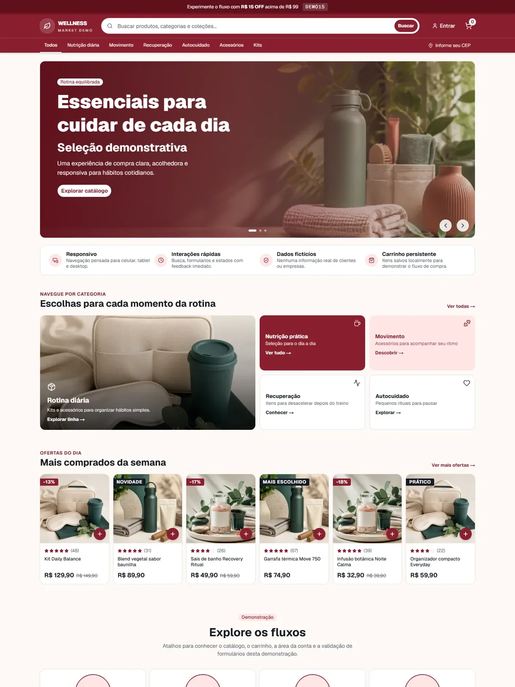

# Commerce Storefront Demo

A polished, responsive storefront built as a standalone full-stack portfolio project. The experience covers product discovery, cart management, account screens, forms, and a map integration while keeping every brand, person, product, price, order, and contact detail fictional.

> [!IMPORTANT]
> This is a UI demonstration. It does not represent a real business and does not process purchases, payments, messages, or personal data.

## What it demonstrates

- Responsive product discovery with carousel, categories, search, and catalog cards
- Typed cart state with quantity controls, calculated totals, and `localStorage` persistence
- Simulated account, order, address, profile, coupon, and checkout flows
- Reusable form validation with React Hook Form and Zod
- Accessible primitives, keyboard-friendly controls, and meaningful responsive states
- Componentized content and business configuration for maintainable product iteration
- Original, optimized storefront artwork with no third-party brand assets

## Preview



## Stack

Next.js 16 · React 19 · TypeScript · Tailwind CSS 4 · Base UI · React Hook Form · Zod · Leaflet · Vitest

## Run locally

```bash
npm install
npm run dev
```

Open [http://localhost:3000](http://localhost:3000).

## Quality checks

```bash
npm run check
```

This runs ESLint, TypeScript, unit tests, and a production build. The same checks run in GitHub Actions.

## Project boundaries

- No backend, database, authentication provider, inventory system, or payment gateway
- Forms validate locally and intentionally do not submit data
- Checkout opens a prefilled draft addressed to the reserved `example.com` domain
- The map location is illustrative and does not identify a store

## License

[MIT](LICENSE) © Gabriel Saraiva
